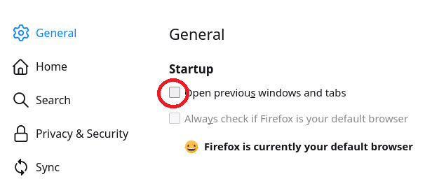
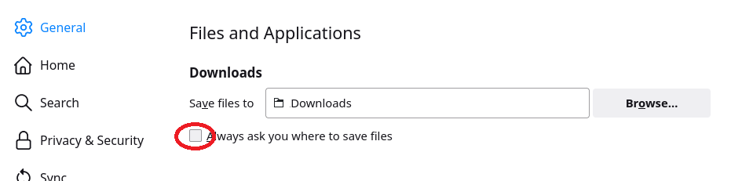
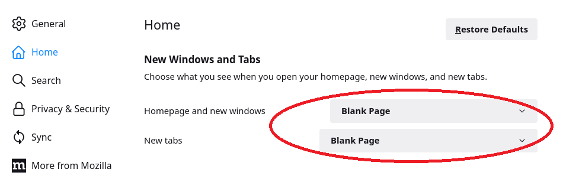
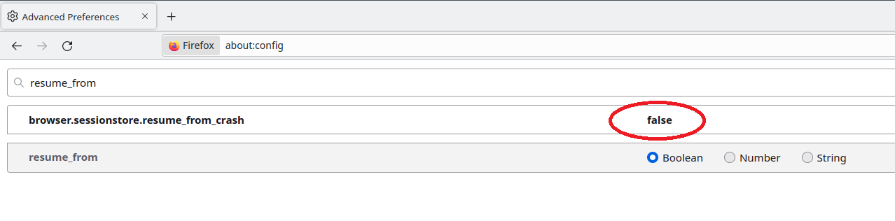

# Environment preparation

## Tools you need

1. Virtual machine with some Debian based linux distribution.\
   Good examples are [Ubuntu](https://ubuntu.com/download) 
   or [AntiX](https://antixlinux.com/download/) (both were tested with this code).\
   You need a desktop OS (headless operations are not supported).
1. Python 3.\
   A virtual environment 
   (like [Conda](https://docs.conda.io/projects/conda/en/latest/user-guide/install/index.html)
   or [Miniconda](https://docs.conda.io/en/latest/miniconda.html))
   is also recommended (but not necessary).
1. [Firefox](https://www.mozilla.org/firefox/download/) 
   and [UI.Vision RPA](https://addons.mozilla.org/firefox/addon/rpa) add-on.
1. Your [Buxfer](https://www.buxfer.com) account.

## Configuration steps

1. Download this repository and prepare your Python environment
   ```sh
   git clone https://github.com/Joker-KP/buxfer-updater.git buxsync  
   conda create -n web python=3.9    # optional
   conda activate web                # optional 
   cd buxsync
   pip install -r requirements.txt
   ```
1. Configure Firefox to make sure no tabs appear when you start the browser
   and download process does not ask for a filename as input.
   * No previous windows nor tabs:
     >      
   * Do not ask name/path on file download:   
     > 
   * Start new session with empty tab:
     >      
   * Disable prompt on browser crash. Again, start new session with empty tab in this case\
     (open _**about:config**_ page and search for _**browser.sessionstore.resume_from_crash**_):
     > 

1. Install [UI.Vision XModules](https://ui.vision/rpa/x/download) (optional step).\
   This will allow you to store your bank login macros on the file system (HDD).
   If you wish to keep them in your browser (as local storage) you do not need it.
   
   You may set _**Home Folder**_ of FileAccess.XModule to `uivision-data` in this repo
   (you can find exemplary macros there).
   

